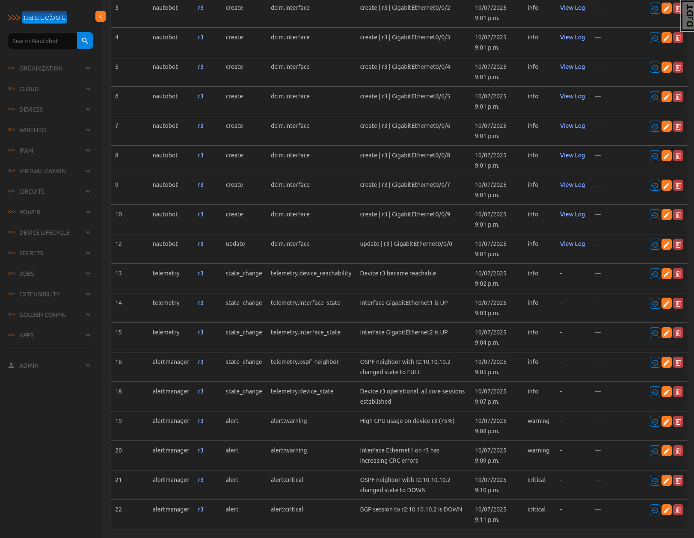

# Nautobot Kafka App - [POC]

The Nautobot Kafka App provides seamless integration between Nautobot and Apache Kafka, enabling real-time event streaming and data synchronization across systems.

## Overview

This app enhances Nautobot’s extensibility by producing and consuming Kafka messages related to network and infrastructure events. It allows Nautobot to act as both a Kafka producer sending structured events to external systems and a Kafka consumer ingesting messages from multiple sources into Nautobot for visibility and correlation.

## Key Features

### Event Production (Job Hooks)

Automatically publishes Kafka messages whenever key Nautobot objects are created, updated, or deleted:

- Devices
- Interfaces
- IP Addresses

### Event Consumption (Consumer Job)

Runs a background job to consume Kafka messages from specified topics and store them in Nautobot as KafkaMessage model objects.

Supports messages from multiple external sources (e.g. Alertmanager, telemetry systems, and other event producers)

Provides a unified view of both Nautobot-generated and external Kafka events

### Extensible Architecture

Designed to be easily customized for additional event types or integrations with other Kafka topics and message formats.

## Use Cases

- Synchronize network state changes between Nautobot and other systems
- Correlate operational data from diverse systems (telemetry, alerts, etc) within Nautobot
- Build event-driven workflows and automation pipelines

## Requirements

- Nautobot >= 2.4.x
- Python Kafka client library (confluent-kafka)

## Installation

Inside Dockerfile
```
RUN pip install git+https:github.com/mspiez/nautobot-kafka-app.git@main
```

## Example views

#### Kafka Messages list view


#### Device Tab Kafka Messages view


